# Figit Import — Figma Plugin Design

**Date:** 2026-06-20
**Status:** Approved design, pending spec review

## Goal

A Figma plugin where the user loads an HTML file (or pastes HTML markup) and gets
editable Figma layers — entirely inside Figma, no `Cmd+V` clipboard step. This
complements the existing browser-extension + clipboard path; it does not replace it.

## Background & Constraints

`@figit/dom-to-figma` walks a **live, rendered DOM**: it reads `getComputedStyle`,
`getBoundingClientRect`, and `range.getClientRects` (44 call sites across the
converter). It cannot run in the Figma plugin sandbox (QuickJS, no DOM). It *can*
run in the plugin's `ui.html`, which is a real browser iframe.

Verified facts (from Figma plugin docs + a live conversion run this session):
- Plugin `ui.html` is an iframe with a full DOM — the converter runs there unchanged.
- A live conversion of a real bundled page ("Send Test", SkillATS) produced 224
  node changes (126 FRAME + 96 TEXT) in ~3.8s with no errors.
- `networkAccess.allowedDomains` gates external requests (fonts/images); the
  fontsource CDN (jsDelivr) must be listed.
- The plugin `ui.html` CSP blocks inline `<script>`. Real exported files
  ("bundled pages") self-unpack via an inline `DOMContentLoaded` script, so they
  must render inside a **nested iframe with its own CSP boundary**.
- Plugin iframes have a null origin → fetch is limited to `Access-Control-Allow-Origin: *`.

`@figit/fig-kiwi` exports **only an encoder** (`encodeFigmaData`,
`composeClipboardHtml`, `KiwiWriter`) — there is no Kiwi decoder. Decoding the
`.fig` clipboard payload would mean writing one from scratch. Therefore the plugin
consumes the converter's in-memory `FigmaClipboard.nodeChanges` (a
`FigmaNodeChange[]`) directly as the intermediate format, and never touches the
binary `.fig` path.

## Scope (V1)

**In:** FRAME, TEXT, GROUP, CANVAS/DOCUMENT roots; SOLID + GRADIENT_LINEAR fills;
drop shadows / inner shadows; corner radius (uniform + per-corner); borders;
auto-layout; fonts via `loadFontAsync` with fallback to Inter.

Auto-layout mapping (from `FigmaFrameNodeChange` stack fields → Plugin API):
- `stackMode` (HORIZONTAL/VERTICAL/NONE) → `layoutMode`
- `stackSpacing` → `itemSpacing`; `stackCounterSpacing` → `counterAxisSpacing`;
  `stackWrap` → `layoutWrap`
- `stackHorizontalPadding`/`stackPaddingRight` → `paddingLeft`/`paddingRight`;
  `stackVerticalPadding`/`stackPaddingBottom` → `paddingTop`/`paddingBottom`
- `stackPrimarySizing` → `primaryAxisSizingMode`;
  `stackCounterSizing` → `counterAxisSizingMode`
- `stackPrimaryAlignItems` → `primaryAxisAlignItems`;
  `stackCounterAlignItems` → `counterAxisAlignItems`
- `stackChildAlignSelf` → child `layoutAlign`;
  `stackChildPrimaryGrow` → child `layoutGrow`

**Out (later versions):** VECTOR nodes (SVG → vectorNetwork), IMAGE nodes
(`figma.createImage`), icon-font glyph fidelity (the "S" placeholder issue).

## Architecture

Two execution contexts, communicating via `postMessage`:

```mermaid
flowchart TD
    A[User: drop .html / paste markup] --> B[render-host: nested sandbox iframe<br/>srcdoc + allow-scripts]
    B --> C{wait for load<br/>+ DOM stabilization}
    C -->|bundled page unpacked| D[dom-to-figma.convert<br/>iframe.contentDocument.body]
    D --> E[FigmaClipboard<br/>nodeChanges: FigmaNodeChange&#91;&#93;]
    E -->|postMessage| F[code.ts: node-builder]
    F --> G[rebuild tree by guid / parentIndex]
    G --> H[create Plugin API nodes<br/>fills · effects · text · auto-layout]
    H --> I[loadFontAsync + Inter fallback]
    I --> J[appendChild to currentPage<br/>scrollAndZoomIntoView]

    subgraph ui[ui.html iframe — DOM, fetch, fontkit]
        A
        B
        C
        D
        E
    end
    subgraph sandbox[code.ts — QuickJS, Plugin API, no DOM]
        F
        G
        H
        I
        J
    end
```



Detailed view:

```
ui.html (iframe — DOM, fetch, fontkit)
  UI layer:     drop-zone for .html  +  textarea for pasted markup
  render-host:  nested <iframe srcdoc=HTML
                     sandbox="allow-scripts allow-same-origin">
                wait for load + DOM stabilization (bundled-page unpack)
  convert:      createFigmaConverter().convert(iframe.contentDocument.body)
                → FigmaClipboard { nodeChanges: FigmaNodeChange[] }
  postMessage({ type: "nodes", nodeChanges })
        │
        ▼
code.ts (sandbox QuickJS — Plugin API, no DOM)
  node-builder: rebuild tree from guid / parentIndex.guid
                recursively create figma.createFrame() / createText()
                apply fills, effects, cornerRadius, auto-layout
                loadFontAsync(family, style) with Inter fallback
                derive x/y/rotation from transform matrix
  figma.currentPage.appendChild(rootFrame)
  figma.viewport.scrollAndZoomIntoView([rootFrame])
```

The core packages (`dom-to-figma`, `fig-kiwi`) are **not modified**. All new code
lives in a new `apps/plugin` workspace.

### New modules

1. **`apps/plugin`** — new workspace. Manifest (`manifest.json` with
   `networkAccess.allowedDomains` for jsDelivr + `devAllowedDomains` for the local
   dev server), `code.ts` (sandbox entry), `ui/` (React, reuses `@figit/ui`).
   Build: plain Vite producing a single bundled `ui.html` and a single `code.js`
   (Figma requires one bundled file each). WXT is not used.

2. **`render-host`** (in `ui/`) — creates the nested sandbox iframe, writes the
   user's HTML, resolves when ready (`load` event + a short DOM-stability watch so
   bundled pages finish unpacking), exposes `contentDocument`, then calls the
   existing `createFigmaConverter().convert()`. This mirrors exactly what was done
   manually in Chrome this session.

3. **`node-builder`** (in `code.ts`) — the main new piece. Consumes
   `FigmaNodeChange[]`, rebuilds the tree by `guid.localID` → `parentIndex.guid`,
   sorts children by `parentIndex.position`, recursively builds Plugin API nodes.
   Sub-modules:
   - `paint-mapper`: `FigmaPaint` (SOLID/GRADIENT_LINEAR; IMAGE skipped in V1) →
     Figma `Paint`. `FigmaColor{r,g,b,a}` is already 0..1, same as Figma.
   - `effect-mapper`: `FigmaEffect` → `node.effects` (DROP_SHADOW/INNER_SHADOW).
   - `text-builder`: `loadFontAsync({family, style})`, on failure fall back to
     `Inter Regular`; then set `characters`, `fontSize`, `lineHeight`,
     `letterSpacing`, `textAlignHorizontal`, `fillPaints`.
   - `transform`: matrix `{m00..m12}` → `x = m02`, `y = m12`, rotation from
     `m00/m10` (typically 0 in V1). Size from `size.{x,y}`. **Shear and non-unit
     scale are not supported in V1** — they are ignored, and a non-trivial shear
     emits a warning (collected into the final import summary).

## Data flow specifics

- `nodeChanges` is flat. The root frame's children point at it via
  `parentIndex.guid`; the converter reserves `ROOT_FRAME_GUID`. The builder keys a
  `Map<localID, change>` and recurses from the root.
- `parentIndex.position` is a string sort key for child ordering.
- Coordinates live in the affine `transform` matrix, not as x/y — the builder
  extracts translate (and, if ever non-zero, rotation) from it.

## Error handling

- **Conversion (ui):** wrapped in try/catch; errors surface as a UI banner/toast;
  the plugin does not crash.
- **Builder (code.ts):** per-node try/catch (same discipline as `walk.ts`); a
  failing node is logged and skipped, the rest still build. Final summary:
  "built N of M nodes, skipped K".
- **Fonts:** load-with-fallback; collect the set of fonts that weren't found in
  Figma and report them to the user.
- **Bundled page didn't unpack (timeout):** convert whatever rendered, plus a
  warning.

## Testing

- **node-builder** — unit tests (vitest, node env): `FigmaNodeChange[]` fixtures →
  assert tree shape, coordinates from matrix, paint/effect mapping. Plugin API
  (`figma.createFrame`, etc.) is mocked.
- **render-host** — reuse the browser-test approach from `dom-to-figma`.
- **E2E** — manual run of the Send Test and Landing scenes in real Figma (as done
  this session), outside CI.

## Known limitations carried into V1

- Icon glyphs rendered as Unicode symbols in a font without those glyphs (e.g.
  SkillATS's `⌕ ▦ 🧩 🛡`) will fall back and may render as Figma's `.notdef`
  placeholder ("S"). Tracked as a separate font-coverage improvement.
- Centered, multi-segment wrapping text (e.g. an `<h1>` with inline `<span>`s)
  currently overlaps — a pre-existing `dom-to-figma` bug already filed as a task,
  independent of the plugin.
- Post-import behavior in V1: imported content is always created as a **new Frame
  on the current page**. The exact placement (offset relative to the viewport),
  selection, and zoom-to-fit are settled in the implementation plan; there is no
  merge-into-existing-frame or re-import-in-place in V1.
